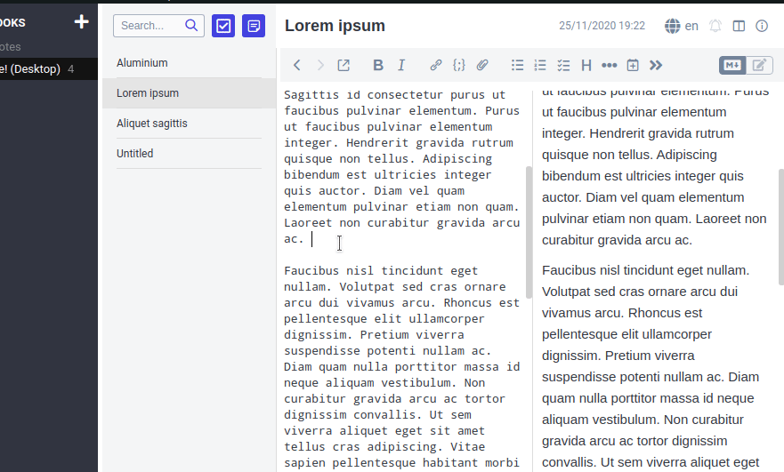

# Complete selected text to link

This plugin adds an icon to the toolbar. When clicked, it completes the selected text into a note title (in a markdown link).

Also adds a link back to the current note.

Tip : Use Ctrl+Shift+← to select the word (or part of word) to the left of the cursor, then click the icon to complete.

This plugin is experimental and comes with absolutely no warranty of any kind. Use at your own risk.

## Joplin Plugin

The main two files you will want to look at are:

- `/src/index.ts`, which contains the entry point for the plugin source code.
- `/src/manifest.json`, which is the plugin manifest. It contains information such as the plugin a name, version, etc.

The plugin is built using webpack, which create the compiled code in `/dist`. The project is setup to use TypeScript, although you can change the configuration to use plain JavaScript.

## Building the plugin

To build the plugin, simply run `npm run dist`.
